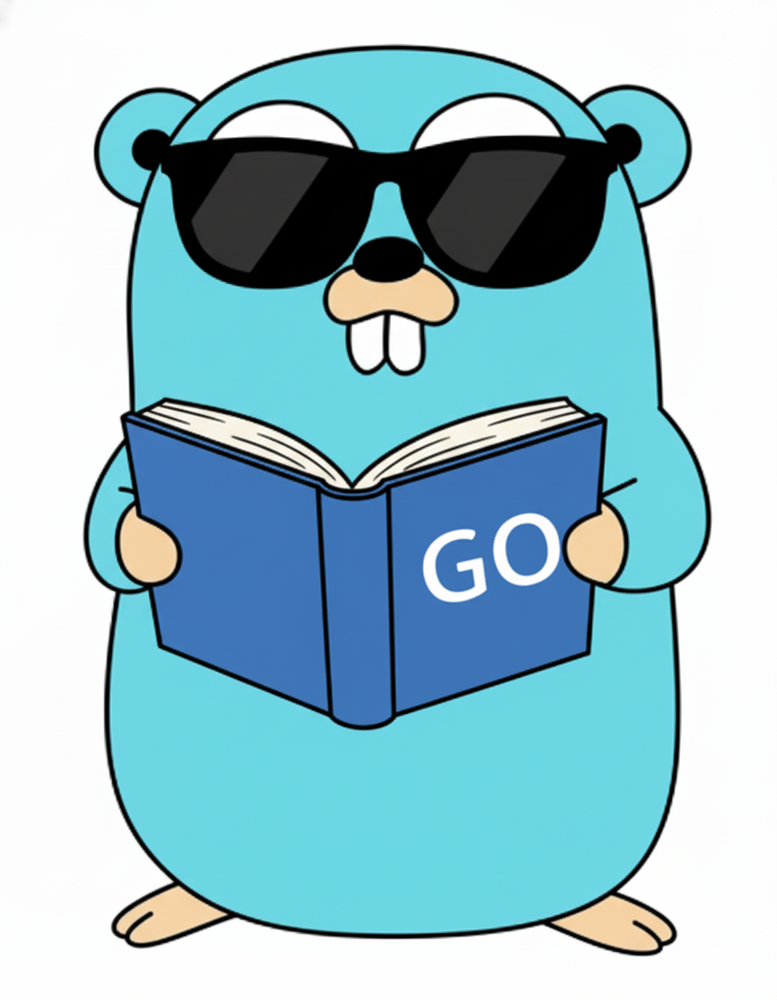

# 
 Golang ChatGPT 🎮🤖




Ferramenta em **Go** para:

- Ler um arquivo `gamelist.xml` (formato usado por Retrobat, Batocera etc.)
- Coletar o conteúdo das tags `<desc>` de cada jogo
- Enviar essas descrições para a **API GPT (OpenAI)**
- Gerar um **novo XML** (`gamelist_pt.xml`) com as descrições **traduzidas** para português do Brasil

É um projeto com foco didático, mostrando na prática:

- Como **ler e escrever XML** em Go
- Como integrar com a **API da OpenAI** usando a lib `go-openai`
- Como montar um pipeline simples de “ler arquivo → processar com IA → salvar resultado”

---

## 🧠 Objetivo do projeto

A ideia principal não é só “traduzir gamelist”, mas:

- Demonstrar **como consumir a API ChatGPT** em Go
- Mostrar manipulação de **estruturas XML**
- Criar um exemplo que qualquer pessoa que mexe com ROMs/emuladores entende e consegue reutilizar até em outras areas

---

## ⚙️ Tecnologias utilizadas
- **Go (Golang)**
    - `encoding/xml`
    - `os`, `path/filepath`
    - `strings`, `time`, `fmt`, `io`
    - **[go-openai](https://github.com/sashabaranov/go-openai)**  

---

## 🗂️ Estrutura do XML (`gamelist.xml`)


O projeto espera um XML no padrão:

```xml
<gameList>
  <game>
    <path>./roms/game1.zip</path>
      <name>Game 1</name>
      <desc>Descrição original em outro idioma...</desc>
      <!-- outros campos opcionais -->
  </game>
<game>
  ...
</game>
</gameList>
```

 ## 📥 Instalação e uso

```code
- git clone https://github.com/fabyo/go-gamelist-gpt.git
- cd go-gamelist-gpt
- go get github.com/sashabaranov/go-openai
- go mod tidy
- const openAIKey = "" <= colocar sua API
- go run main.go "D:\roms\megadrive"
```

